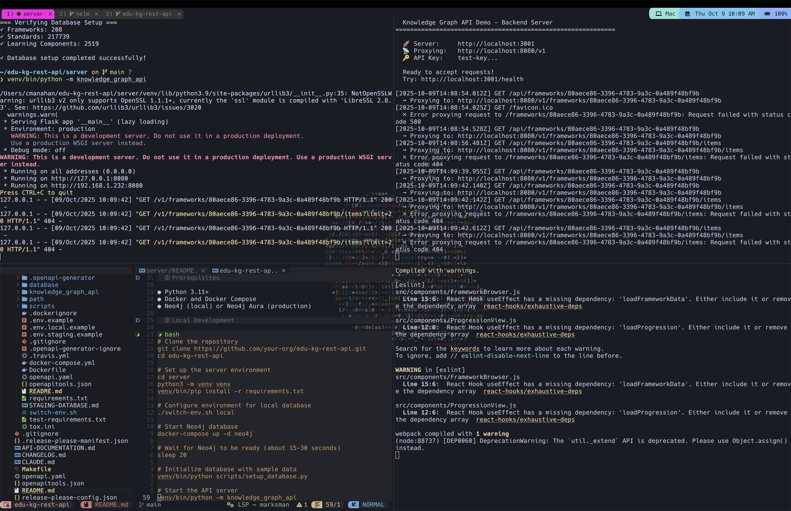
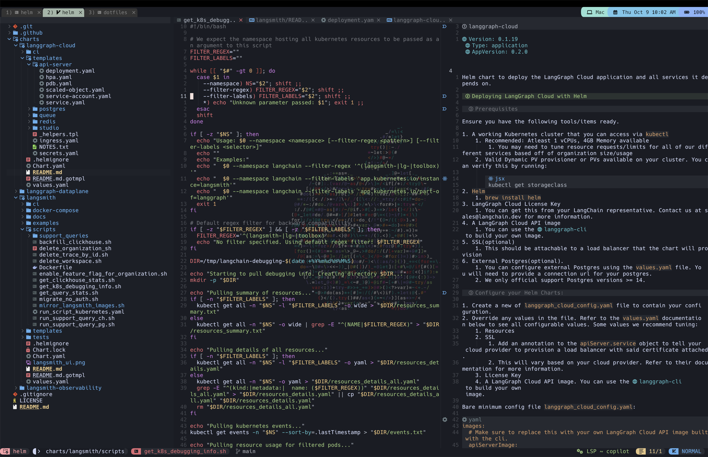
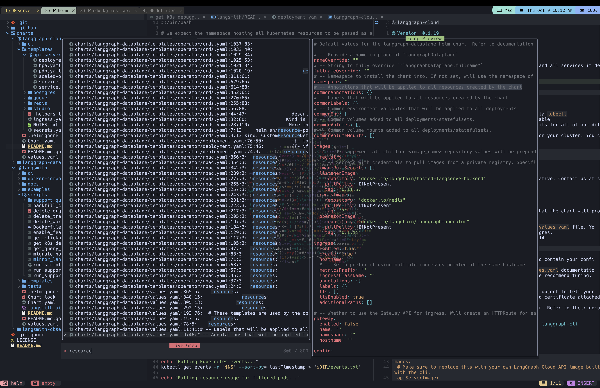

# Dotfiles

Personal development environment configuration using GNU Stow.

## Features

- **Git**: Version control with comprehensive aliases and modern defaults
- **Wezterm**: Smart terminal with custom tab formatting, smart-splits integration, and per-directory tab colors
- **Neovim**: NvChad v2.5 with extensive LSP, formatting, completion, and navigation plugins
- **ZSH**: Vi-mode, autosuggestions, syntax highlighting, FZF integration, and enhanced directory navigation
- **Starship**: Custom prompt with Catppuccin Mocha theme
- **tmux**: Terminal multiplexer with floating terminal integration in Neovim
- **k9s**: Kubernetes CLI manager with cross-platform config (~/.config/k9s/ via K9S_CONFIG_DIR) and dedicated Neovim terminal

## Screenshots

### Wezterm with Split Terminals


### Neovim with Split Editor


### Neovim with Ripgrep Search


## Requirements

 - git
 - git-delta (optional but recommended for enhanced diffs)
 - eza
 - zoxide
 - stow
 - wezterm
 - starship
 - neovim
 - font-hack-nerd-font
 - ripgrep
 - tmux
 - k9s
 - fzf (fuzzy finder)
 - fd (find alternative)
 - bat (cat alternative with syntax highlighting)
 - zsh
 - zsh-vi-mode
 - zsh-autosuggestions
 - zsh-syntax-highlighting

## Installation

### 1. Install Homebrew dependencies

```bash
brew install eza zoxide stow zsh zsh-vi-mode zsh-autosuggestions zsh-syntax-highlighting starship neovim ripgrep tmux k9s git-delta fzf fd bat
brew install --cask font-hack-nerd-font wezterm
```

### 2. Clone dotfiles repository

```bash
git clone https://github.com/christophermanahan/dotfiles.git ~/dotfiles
cd ~/dotfiles
```

### 3. Deploy configurations with Stow

```bash
# Remove existing configs if present
rm -f ~/.zshrc

# Stow configurations (creates symlinks from repo to home directory)
stow git      # Deploys to ~/.gitconfig
stow wezterm
stow zsh
stow starship
stow nvim
stow tmux
stow k9s      # Cross-platform: deploys to ~/.config/k9s/ (K9S_CONFIG_DIR enforces XDG)
```

### 4. Reload shell configuration

```bash
source ~/.zshrc
```

### 5. Launch Neovim to install plugins

On first launch, Neovim will automatically:
- Install NvChad (v2.5)
- Install all plugins via Lazy.nvim
- Install LSP servers via Mason (HTML, CSS, TypeScript, Python, Rust, Terraform, Docker, Prisma, Markdown)

```bash
nvim
```

Wait for all installations to complete, then restart Neovim.

## Shortcuts

### Wezterm

**Leader Key:** `Ctrl+A`

#### Window Management
| Shortcut | Action |
|----------|--------|
| `Ctrl+'` | Split vertical |
| `Ctrl+b` | Split horizontal |
| `Ctrl+h/j/k/l` | Navigate between panes (nvim/wezterm) |
| `Ctrl+z` | Zoom pane |
| `Ctrl+x` or `Leader+[` | Copy mode (vi keys to navigate) |
| `Leader+h/j/k/l` | Resize panes |
| `Leader+f` | Toggle fullscreen |

#### Tab Management
| Shortcut | Action |
|----------|--------|
| `CMD+w` | Close current tab |
| `CMD+Shift+h` | Move tab left |
| `CMD+Shift+l` | Move tab right |
| `Leader+w` | Tab navigator |
| `Leader+m` | Quick launch menu (k9s, lazygit, lazydocker, btm, htop) |

#### Terminal
| Shortcut | Action |
|----------|--------|
| `CMD+L` | Clear terminal |

### Neovim

**Leader Key:** `Space`

#### File Navigation
| Shortcut | Action |
|----------|--------|
| `<leader>e` | Focus current file in tree |
| `Ctrl+h/j/k/l` | Navigate between splits |
| `s` + motion | Flash jump (quick navigation) |
| `S` + motion | Flash treesitter jump |

#### Nvim-Tree (File Explorer)
| Shortcut | Action |
|----------|--------|
| `h` | Close directory / Navigate to parent |
| `l` | Open directory or file |
| `W` | Collapse all directories |

#### Code Navigation
| Shortcut | Action |
|----------|--------|
| `gd` | Go to definition |
| `gD` | Go to declaration |
| `gi` | Go to implementation |
| `gr` | View references (telescope) |
| `<leader>D` | Go to type definition |
| `gpd` | Preview definition |
| `gpt` | Preview type definition |
| `gpi` | Preview implementation |
| `gpD` | Preview declaration |
| `gpr` | Preview references |
| `gP` | Close preview |

#### Code Actions
| Shortcut | Action |
|----------|--------|
| `ga` | Code actions |
| `<leader>ra` | Rename symbol |
| `<leader>S` | Search and replace (GrugFar) |

#### Tabs & Buffers
| Shortcut | Action |
|----------|--------|
| `gC` | New tab |
| `gt` | Next tab |
| `gT` | Previous tab |
| `<leader>X` | Close all other buffers |

#### Git
| Shortcut | Action |
|----------|--------|
| `<leader>gh` | Open lazygit (floating terminal) |

#### Terminal Management
| Shortcut | Action |
|----------|--------|
| `ALT+i` | Toggle floating tmux terminal |
| `ALT+k` | Toggle Claude Code terminal |
| `ALT+j` | Toggle k9s terminal |
| `ALT+o` | Kill any floating terminal (restarts on reopen) |
| `ESC ESC` | Exit terminal mode to normal mode |

#### Window & Display
| Shortcut | Action |
|----------|--------|
| `<leader><` | Decrease window width |
| `<leader>>` | Increase window width |
| `<leader>tw` | Toggle word wrap |
| `<leader>mp` | Toggle markdown preview in browser |
| `<leader>.` | Repeat last command |

#### General
| Shortcut | Action |
|----------|--------|
| `<leader>w` | Write (save) |
| `<leader>q` | Quit |
| `<leader>Q` | Quit all |

### tmux

**Leader Key:** `Ctrl+F`

#### Pane Management
| Shortcut | Action |
|----------|--------|
| `ALT+v` | Split vertical (no prefix) |
| `ALT+s` | Split horizontal (no prefix) |
| `ALT+x` | Close pane (no prefix) |
| `Ctrl+h/j/k/l` | Navigate panes (no prefix) |
| `Leader+h/j/k/l` | Resize panes |

#### Window Management
| Shortcut | Action |
|----------|--------|
| `Leader+c` | New window |
| `Leader+r` | Rename window |
| `Leader+w` | Window navigator |

#### Copy Mode (Scrolling)
| Shortcut | Action |
|----------|--------|
| `Leader+[` | Enter copy mode |
| `j/k` | Scroll down/up (in copy mode) |
| `Ctrl+d/Ctrl+u` | Page down/up (in copy mode) |
| `g/G` | Top/bottom of scrollback (in copy mode) |
| `/` | Search forward (in copy mode) |
| `q` or `Esc` | Exit copy mode |

### ZSH

| Shortcut | Action |
|----------|--------|
| `Ctrl+Space` | Accept autosuggestion |
| `Tab` | Show completions / cycle through options |
| `Arrow keys` or `h/j/k/l` | Navigate completion menu |
| `Enter` | Accept selected completion |
| `Esc` | Cancel completion menu |
| `ls` | Enhanced tree view (eza) with git-ignore |
| `cd` → `z` | Smart directory jumping (zoxide) |
| `cat` | Enhanced file viewing with syntax highlighting (bat) |
| `find` | Fast file searching (fd) |

#### Vi Mode
| Shortcut | Action |
|----------|--------|
| `jk` | Enter normal mode (alternative to ESC) |
| `ESC` | Enter normal mode (leaves ESC+ESC for terminal scrollback) |
| `i` | Enter insert mode |
| `v` | Enter visual mode |

#### FZF (Fuzzy Finder)
| Shortcut | Action |
|----------|--------|
| `Ctrl+T` | Paste selected files/directories onto command line |
| `Ctrl+R` | Search command history (fuzzy) |
| `Alt+C` | cd into selected directory |

#### Git Aliases (Shell)
| Alias | Command |
|-------|---------|
| `lg` | lazygit |
| `gst` | git status |
| `gco` | git checkout |
| `gcb` | git checkout -b |
| `gp` | git push |
| `gpl` | git pull |
| `gcm` | git commit -m |
| `glog` | git log --oneline --graph --decorate --all |

## Configuration Details

### Git Configuration

**Useful Aliases:**
- `git s` - Short status
- `git br` - List branches sorted by last modified
- `git lg` - Commit history with graph
- `git l` - Short log (last 10 commits)
- `git amend` - Amend last commit without editing message
- `git undo` - Undo last commit but keep changes
- `git today` - Show commits from today
- `git pushf` - Push force with lease (safer than --force)
- `git clean-merged` - Delete branches that have been merged

**Modern Defaults:**
- Auto-setup remote tracking on push
- Rebase by default on pull with auto-stash
- Auto-prune deleted remote branches
- Use 'main' as default branch name
- Better diff algorithm (histogram)
- Show moved lines in diffs
- Conflict style with common ancestor (diff3)
- Delta integration for syntax-highlighted diffs with side-by-side view and line numbers

### FZF Configuration

**Managed via `.fzf.zsh` (stowed to `~/.fzf.zsh`)**

**Search Commands:**
- Uses `fd` (fast find alternative) for file searching
- Includes hidden files and follows symlinks
- Excludes .git directories automatically

**Display Options:**
- 40% screen height with reverse layout
- Border around window
- Live preview with `bat` (syntax-highlighted, 500 lines)

**Key Bindings:**
- `Ctrl+T`: Fuzzy find files and paste path
- `Ctrl+R`: Fuzzy search command history
- `Alt+C`: Fuzzy find and cd to directory

**Integration:**
- Works seamlessly with `fd`, `bat`, and `ripgrep`
- Completion and key bindings from homebrew installation
- Custom preview window with syntax highlighting

### Neovim Plugins

**LSP & Language Support:**
- mason-lspconfig (auto-installs: HTML, CSS, TypeScript, Python, Rust, Terraform, Docker, Prisma, Markdown)
- typescript-tools.nvim (root detection via .npmrc)
- pyright (Python LSP)

**Formatting:**
- conform.nvim with prettierd (JS/TS/CSS/HTML), biome, and stylua (Lua)
- Auto-format on save enabled

**Completion:**
- nvim-cmp with Copilot integration
- LSP prioritized over Copilot suggestions
- Signature help enabled

**Navigation:**
- smart-splits.nvim (seamless pane navigation with wezterm)
- flash.nvim (quick jumps with `s` and `S`)
- telescope.nvim with fzf extension

**Git:**
- lazygit (via floating terminal with `<leader>gh`)
- diffview.nvim for enhanced diff viewing
- gitsigns disabled (using lazygit)

**UI Enhancements:**
- noice.nvim (command line UI)
- nvim-notify (notifications)
- trouble.nvim (diagnostics)
- rainbow-delimiters (bracket colorization)
- catppuccin theme (Mocha flavor, transparent background)

**Other:**
- nvim-surround (surround text objects)
- grug-far.nvim (search and replace)
- goto-preview (preview definitions)
- todo-comments (highlight TODO/FIXME/etc)
- markdown-preview.nvim (live markdown preview in browser)

### Wezterm Features

- Smart-splits integration for Ctrl+hjkl navigation
- Custom tab formatting: tab index, process icon, current directory
- Per-directory unique tab colors (derived from cwd path)
- Status bar with hostname, date/time, battery
- Quick launch menu for common tools (Leader+m)
- Catppuccin Mocha theme with background image overlay
- Process-aware tab icons (nvim, docker, git, etc.)

### tmux Configuration

- Dracula theme with custom status bar
- Status bar at top
- Custom left status: pane count
- Custom right status: current directory, current command, PREFIX indicator
- Window zoom indicator
- Catppuccin-inspired colors

### ZSH Configuration Details

**Performance Optimizations:**
- `KEYTIMEOUT=1` - Reduces vi mode switching delay from 400ms to 10ms for instant ESC/jk response
- Starship initialized in `zvm_after_init()` callback to avoid ZLE widget conflicts
- Proper plugin loading order to prevent infinite recursion

**Vi Mode Features:**
- Instant mode switching with `jk` or `ESC` (10ms response)
- Vi-style navigation in completion menu (h/j/k/l)
- Works seamlessly in Claude Code terminals and floating terminals
- ESC+ESC preserved for terminal scrollback mode

**Shell Integrations:**
- FZF with fd/bat for enhanced file finding and previews
- Zoxide for smart directory jumping
- Enhanced aliases: cat→bat, find→fd, ls→eza
- Git aliases: lg (lazygit), gst, gco, gcb, gp, gpl, gcm, glog

**Loading Order (Critical for stability):**
1. Homebrew environment
2. Environment variables (K9S_CONFIG_DIR, STARSHIP_CONFIG, KEYTIMEOUT)
3. Completion system
4. Zoxide
5. zsh-vi-mode plugin
6. Syntax highlighting & autosuggestions
7. `zvm_after_init()` callback - Starship init & keybindings
8. FZF configuration

### Troubleshooting

**Issue: "maximum nested function level reached" error**
- **Cause:** Starship and zsh-vi-mode ZLE widget conflict
- **Solution:** Already fixed - Starship initializes in `zvm_after_init()`
- **Prevention:** Never initialize prompt themes before zsh-vi-mode

**Issue: Slow vi mode switching (400ms delay)**
- **Cause:** Default KEYTIMEOUT=40
- **Solution:** Already fixed - KEYTIMEOUT=1 set before zsh-vi-mode
- **Result:** Instant 10ms response for ESC and jk

**Issue: k9s not loading custom skins**
- **Cause:** MacOS defaults to ~/Library/Application Support/k9s/
- **Solution:** Already fixed - K9S_CONFIG_DIR forces ~/.config/k9s/
- **Verification:** Run `echo $K9S_CONFIG_DIR` should show ~/.config/k9s

**Issue: FZF not working (Ctrl+T, Ctrl+R, Alt+C)**
- **Solution:** Ensure fzf, fd, and bat are installed via homebrew
- **Check:** `which fzf fd bat` should show homebrew paths
- **Reload:** `source ~/.zshrc` after installing

**Issue: ESC key interfering with Claude Code**
- **Solution:** Use `jk` to enter vi normal mode instead
- **Benefit:** No interrupt signals, preserves ESC+ESC for scrollback

### Deprecated

 - `kitty` (replaced by wezterm)
 - `ohmyzsh` (using minimal zsh config)
 - `powerlevel10k` (replaced by starship)
 - `neogit` (replaced by lazygit)

